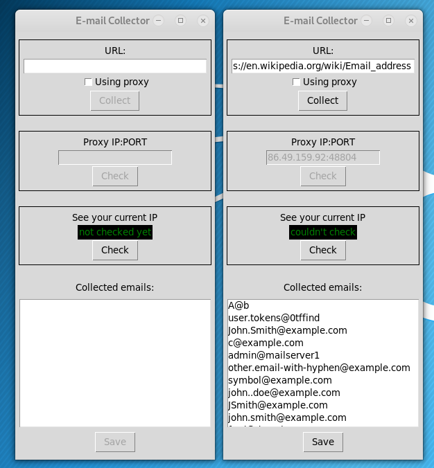

Email Collector
===============

This is a small python program which can/try to collect emails from the given website.

Description
-----------

You can collect emails if you give a valid url to program.
The program tries to check your given url syntax but it is not flawless enough.
But if a url does not point to an existing website on the internet, You will get a error window.

You can use proxy, too. If you want to use proxy, You have to check the connection after the program check its syntax.
The program will notify you if it is good or bad.

You can check this website for a proxy.
* https://www.free-proxy-list.net/

You can check your ip if you want to know what others see.

If the program find emails from your given url, then you can save collected email plus url in a .txt or .csv file.

Screenshot
-----------

	

